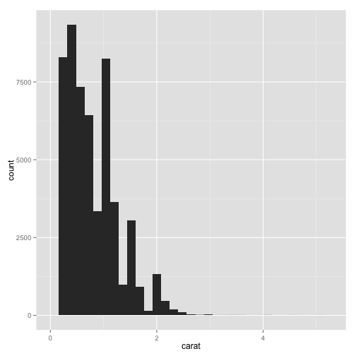
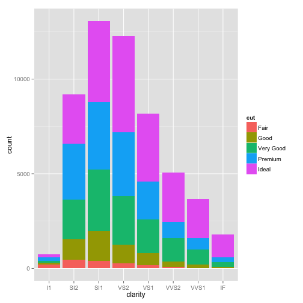
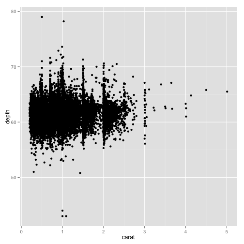
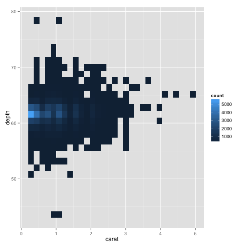

ggplot2 tutorial
========================================
author: Amelia McNamara
date: April 22, 2015

ggplot2
========================================

ggplot2 is an R package by Hadley Wickham that lets you make beautiful graphics in R (relatively) easily. 

It's part of the Hadleyverse, which I recommend everyone get to know. It includes the packages dplyr, reshape2, stringr, lubridate... many more.

The name ggplot2 is short for The Grammar of Graphics (a famous book by Leland Wilkinson about the theory of data visualization) and the 2 refers to the fact that it's Hadley's second version (the first version was for his dissertation).

Getting started
========================================

First, we need to install and load the package

```r
#install.packages("ggplot2")
library(ggplot2)
```

Demo data
========================================
I'm going to use the diamonds data that comes with ggplot2,


```r
str(diamonds)
```

```
'data.frame':	53940 obs. of  10 variables:
 $ carat  : num  0.23 0.21 0.23 0.29 0.31 0.24 0.24 0.26 0.22 0.23 ...
 $ cut    : Ord.factor w/ 5 levels "Fair"<"Good"<..: 5 4 2 4 2 3 3 3 1 3 ...
 $ color  : Ord.factor w/ 7 levels "D"<"E"<"F"<"G"<..: 2 2 2 6 7 7 6 5 2 5 ...
 $ clarity: Ord.factor w/ 8 levels "I1"<"SI2"<"SI1"<..: 2 3 5 4 2 6 7 3 4 5 ...
 $ depth  : num  61.5 59.8 56.9 62.4 63.3 62.8 62.3 61.9 65.1 59.4 ...
 $ table  : num  55 61 65 58 58 57 57 55 61 61 ...
 $ price  : int  326 326 327 334 335 336 336 337 337 338 ...
 $ x      : num  3.95 3.89 4.05 4.2 4.34 3.94 3.95 4.07 3.87 4 ...
 $ y      : num  3.98 3.84 4.07 4.23 4.35 3.96 3.98 4.11 3.78 4.05 ...
 $ z      : num  2.43 2.31 2.31 2.63 2.75 2.48 2.47 2.53 2.49 2.39 ...
```

qplot()
========================================
Then, if you want to take the easiest way out, you can use qplot()

```r
qplot(carat, data=diamonds)
```

 

ggplot2 syntax
========================================

```r
qplot(carat, data=diamonds)
```
Already, this might seem a little different, because you're not using the $ operator. 

Instead, you're listing the name of the variable(s) and then telling R where to "look" for that variable with data=. This is like what we do when modeling using functions like lm().

More qplot()
========================================


```r
qplot(clarity, fill=cut, data=diamonds)
```

 

ggplot()
========================================

But, in order to really harness the power of the ggplot2 package you need to use the more general ggplot() command. The basic idea of the package is that you can "layer" pieces on top of a plot to build it up over time. 


```r
p <- ggplot(aes(x=clarity, fill=cut), data=diamonds)
```
If you try to show p at this point, you will get the error Error: No layers in plot

When you start your ggplot, you always need to use a ggplot() call, which initializes the plot. I usually put my dataset in here, and at least some of my "aesthetics." But, one of the things that can make ggplot2 tough to understand is that there are no hard and fast rules. 

ggplot()
========================================

Then, you need to use "geoms" (geometric objects) to specify the way you want your variables mapped to graphical parameters.


```r
p + geom_bar()
```

 

ggplot()
========================================


```r
p <- ggplot(aes(x=carat, y=depth), data=diamonds)
p + geom_point()
```

 

Another geom
========================================

```r
p + geom_bin2d()
```

 


Resources for ggplot2
========================================
* [ggplot2 cheatsheet](http://www.rstudio.com/wp-content/uploads/2015/03/ggplot2-cheatsheet.pdf)
* [R graphics cookbook](http://www.cookbook-r.com/Graphs/)
